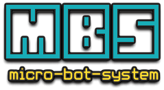

steps to start:

- start docker container
```
ci/docker-run.sh
```

- setup build environment
```
. ci/yocto-build.env
```

- build and run a minimal ramdisk image
```
bitbake image-busybox
runqemu nographic slirp ramfs
# quit qemu by <ctrl> a + x
```
